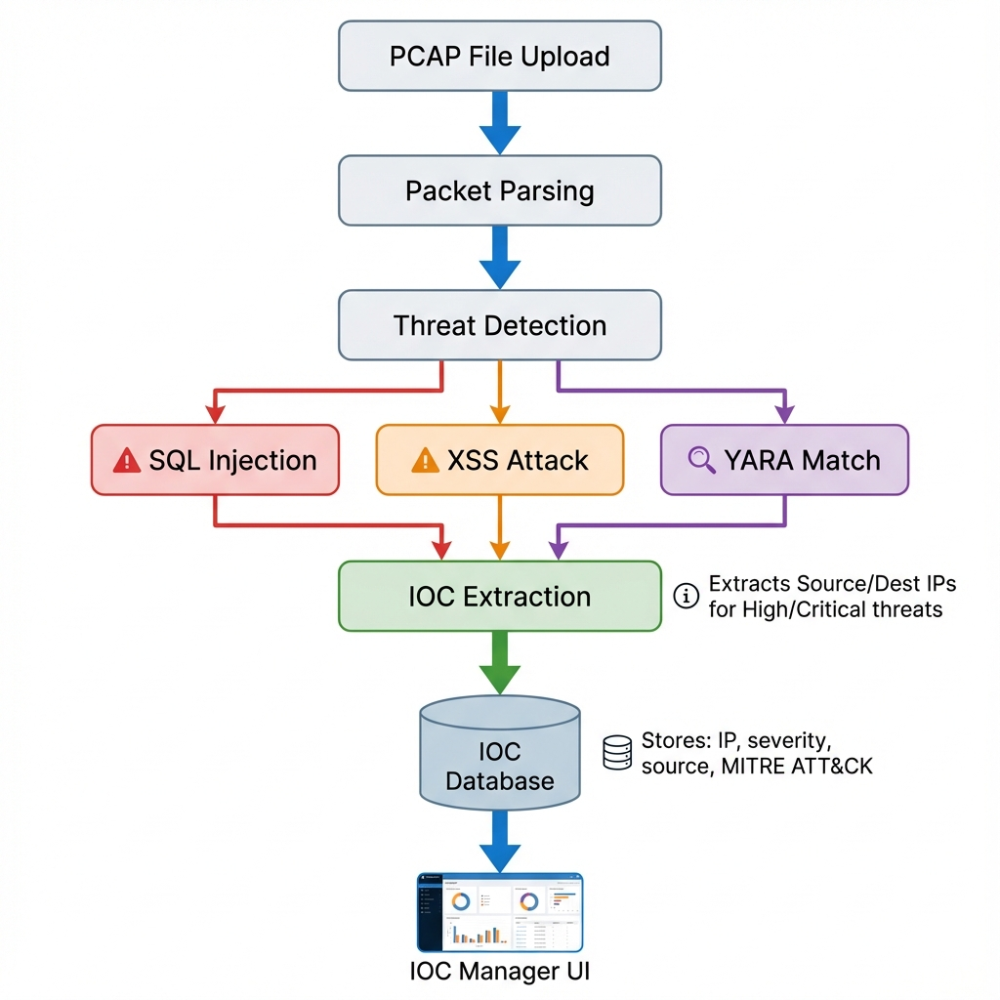

# Network Traffic Parser

A comprehensive web application and CLI toolkit for monitoring network performance and analyzing network traffic data. Built with React, TypeScript, and Tailwind CSS, this tool helps developers monitor application performance in real-time and analyze static PCAP files for deeper insights.

## 📺 Demo Video

See the Network Traffic Parser in action, from uploading a PCAP file to identifying SQL injection threats and analyzing packet details.


"You want the truth? NetPackParser **can** handle the truth."

"Know thy enemy with NetPackParser Threat and Forensics Analysis."

"PCAP because NetPackParser knows what happened."


## 🏗️ Project Architecture

This project follows a **hybrid client-server architecture** designed to support scalable analysis:

1.  **Frontend (Client)**: A React/Vite application for visualization and user interaction.
2.  **Backend (Server)**: A Node.js server that acts as the API gateway and coordination layer.
3.  **Data Pipeline**:
    *   **Kafka (Redpanda)**: Handles streaming of PCAP data for asynchronous processing.
    *   **Elasticsearch**: Stores indexed packet data for fast search and retrieval.
    *   **Workers**: Background workers consume from Kafka to parse and index data.

### Directory Structure

```
net-pack-parser/
├── client/              # Browser UI (Vite + React + TypeScript)
├── server/              # Backend API & Workers (Node.js + Express)
├── docker-compose.yml   # Infrastructure definition (Redpanda, Elasticsearch)
└── package.json         # Root configuration
```

---

## 🚀 Getting Started

### Prerequisites

-   **Node.js** (version 22.x LTS recommended)
-   **npm** (comes with Node.js)
-   **Docker** & **Docker Compose** (Required for Kafka & Elasticsearch)
    *   *Ensure the Docker daemon is running by executing `docker info` in your terminal.*
    *   *If it's not running, start **Docker Desktop** (Mac/Windows) or run `sudo systemctl start docker` (Linux).*

    If you are using colima (MacOS), you can start the containers with `colima start` and stop them with `colima stop`.
    
-   **Git**

### Installation

1.  **Clone the Repository**
    ```bash
    git clone https://github.com/your-username/network-traffic-parser.git
    cd network-traffic-parser
    ```

3.  **Start Infrastructure (Docker)**
    The application relies on Redpanda (Kafka) and Elasticsearch. Use Docker Compose to manage them.

    *   **Start Containers:**
        ```bash
        docker-compose up -d
        ```
        *Wait a few moments for the containers to initialize (healthy).*

    *   **Stop Containers:**
        When finished, you can stop the infrastructure to save resources:
        ```bash
        docker-compose down
        ```

3.  **Install Client Dependencies**
    ```bash
    cd client
    npm install
    ```

4.  **Install Server Dependencies**
    ```bash
    cd ../server
    npm install
    ```

### 💻 Running the Application

You can run the full stack (Client, Server, Database, Kafka) using Docker Compose, or run components individually for development.

#### Option 1: Full Stack (Docker) - Recommended for Usage
Pass the `--build` flag the first time to build the images.

```bash
docker-compose up -d --build
```

-   **Client**: [http://localhost:5173](http://localhost:5173)
-   **Server**: [http://localhost:3000](http://localhost:3000)

> [!NOTE]
> **Rebuilding after changes:**
> If you modify the source code, you must rebuild the containers to see the changes:
> ```bash
> docker-compose up -d --build
> ```

#### Option 2: Development Mode (Local Node.js)
Use this mode if you want to modify code and see changes instantly.

**1. Start Infrastructure Only**:
```bash
docker-compose up -d redpanda elasticsearch
```

**2. Start Server**:
```bash
cd server
npm run dev
```

**3. Start Client**:
```bash
cd client
npm run dev
```

### 🔐 Authentication (Remote/Live Capture)

Remote Capture and Live Capture features require authentication. Default credentials:

| Setting | Default | Environment Variable |
|---------|---------|---------------------|
| Username | `admin` | `ADMIN_USER` |
| Password | `password` | `ADMIN_PASS` |
| JWT Secret | `dev-secret-key-change-in-prod` | `JWT_SECRET` |

**For Production:** Set environment variables before starting the server:
```bash
export ADMIN_USER="your_username"
export ADMIN_PASS="your_secure_password"
export JWT_SECRET="your-random-secret-key"
npm run start
```

### 🧪 Testing

The project includes Unit Tests (Vitest).

#### Unit Tests (Client)
Run unit tests for the frontend components and logic:

```bash
cd client
npm test
```

To run in watch mode:
```bash
cd client
npm run test:watch
```

### 📦 Building for Production

To build the client application for production deployment:

1.  Navigate to the client directory:
    ```bash
    cd client
    ```

2.  Run the build command:
    ```bash
    npm run build
    ```

3.  (Optional) Preview the production build locally:
    ```bash
    npm run preview
    ```

The build artifacts will be generated in the `client/dist` directory, ready for static hosting.

---

## ✨ Feature Showcase

### 🔍 Deep Packet Inspection (DPI) & Analysis
*   **PCAP/PCAPNG Support**: Drag-and-drop upload for analyzing standard capture files.
*   **Protocol Detection**: Automatic classification of HTTP, DNS, SSH, FTP, SMTP, and more.
*   **Hex & ASCII Dump**: Traditional packet inspector view with side-by-side hex and ASCII representation.
*   **String Extraction**: Automatically extracts emails, URLs, IPs, and potential credentials (API keys, passwords) from payloads.
*   **File Carving**: Reassembles and extracts files (Images, PDFs, ZIPs) transferred over HTTP/FTP with integrity hash verification.

### 🛡️ Threat Detection & Security
*   **Signature Matching**: Detects common web attacks like **SQL Injection** (`' OR '1'='1`), **XSS** (`<script>`), and **Command Injection**.
*   **YARA Integration**: Run custom or built-in YARA rules against packet payloads to identify malware signatures.
*   **MITRE ATT&CK Mapping**: Alerts are mapped to specific TTPs (Techniques, Tactics, and Procedures) with links to the MITRE framework.
*   **IOC Database**: Manage Indicators of Compromise (IPs, Domains, Hashes) and automatically flag traffic matching known threats.
*   **Sensitive Data Redaction**: Automatically detects and masks Credit Card numbers and SSNs in the UI.

#### 🎯 Automatic IOC Extraction

The application automatically extracts and catalogs Indicators of Compromise (IOCs) from detected threats, building an intelligence database without manual intervention.



**How It Works:**

When analyzing PCAP files, the system performs multi-layered threat detection:
1. **Pattern Matching**: SQL injection, XSS, command injection, sensitive data leaks
2. **YARA Scanning**: Custom malware signatures and known attack patterns
3. **IOC Extraction**: Automatically captures source/destination IPs from threats

**Extraction Rules:**
- ✅ **High/Critical Severity Threats** → Source IP extracted as IOC
- ✅ **Critical Severity Threats** → Destination IP also extracted (potential C2 servers)
- ✅ **Medium/Low Threats** → Logged but not added to IOC database (prevents false positive bloat)

**IOC Metadata:**
Each auto-generated IOC includes:
- **Type**: IP address, domain, hash, or URL
- **Severity**: Inherited from the triggering threat (critical, high, medium, low, info)
- **Source**: "Threat Detection" or "YARA Detection"
- **Description**: Details about the threat that triggered the IOC
- **MITRE ATT&CK Tags**: Technique IDs for correlation and reporting

**Example**: If a packet contains SQL injection patterns from IP `192.168.1.100`, the system:
1. Logs a "High" severity threat alert
2. Automatically creates an IOC entry for `192.168.1.100`
3. Tags it with MITRE technique `T1190` (Exploit Public-Facing Application)
4. Makes it immediately searchable in the IOC Manager

This intelligence feeds back into analysis: future packets matching these IOCs are automatically flagged, creating a continuously improving detection system.

### 🔎 Search & Filtering
*   **BPF Engine**: fast filtering using standard Berkeley Packet Filter syntax (e.g., `tcp port 80 and host 10.0.0.1`).
*   **Multi-Criteria Search**: logical search builder (AND/OR) for combining IP ranges, ports, time windows, and payload content.
*   **Visual Highlighting**: Search terms and extracted artifacts are highlighted directly in the hex dump and packet list.

### 🕵️ Forensic Investigation
*   **Timeline Analysis**: Zoomable chronological visualization of traffic spikes and event correlations.
*   **Chain of Custody**: Immutable audit log of all file operations (hashes, uploads, exports) to ensure evidence integrity.
*   **Case Management**: Add notes, bookmark packets, and generate PDF forensic reports with attached evidence.
*   **Geo-Location**: Visualize traffic sources and destinations on an interactive world map.

### ⚡ Live Capture & Streaming
*   **Remote Agent**: Lightweight Node.js agent to capture traffic from remote servers/containers.
*   **Real-Time Streaming**: WebSocket-based streaming of live packets to the dashboard.
*   **Live Analysis**: Threats and metrics are calculated in real-time as packets arrive.

### 📊 Performance Monitoring
*   **Core Web Vitals**: Track specific web performance metrics (LCP, CLS, FID) for HTTP traffic.
*   **Waterfall View**: Visualize resource loading sequences and timing.

---

## 🔧 Technical Details

-   **Frontend**: React 19, TypeScript, Vite, Tailwind CSS, shadcn/ui
-   **State Management**: TanStack Query (Server State), Zustand (UI State)
-   **Parsing**: Node.js backend for PCAP processing (server-side)
-   **Testing**: Vitest, React Testing Library

---

## 📄 License

This project is dual‑licensed under **MIT** and **Apache 2.0**.
