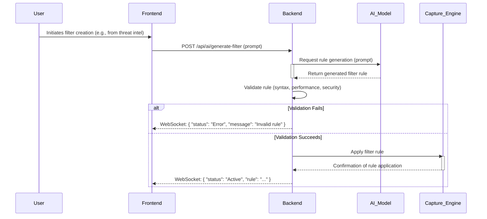

# Architecture

## Executive Summary

This architecture outlines `net-pack-parser`, a performant, cross-platform network analysis tool built in Rust. It features a CLI and an optional React-based web dashboard for real-time and offline packet capture, filtering, and threat detection. The design prioritizes high-throughput (1 Gbps) and low-latency alerting while supporting a novel AI-driven filter creation workflow.

## Project Initialization

First implementation story should execute:
```bash
cargo new net-pack-parser-backend --bin
cd net-pack-parser-backend
cargo add actix-web
```

This establishes the base backend architecture with these decisions:
- **Backend Language:** Rust
- **Backend Web Framework:** Actix Web
- **Backend Build Tooling:** Cargo
- **Backend Linting/Formatting:** Rustfmt
- **Backend Testing:** Rust's `cargo test` framework

## Decision Summary

| Category | Decision | Version | Affects Epics | Rationale |
| -------- | -------- | ------- | ------------- | --------- |
| Data Persistence | SQLite for structured data, File System for raw files | SQLite 3.51.0, OS Native | All | Balances performance, simplicity, and query capabilities for an embedded tool. |
| API Communication | REST API for general data/control, WebSockets for real-time streaming | REST (HTTP/1.1), WebSockets (RFC 6455) | Data Ingestion, Threat Detection, Alerting, Extensibility | Balances simplicity and broad compatibility of REST with the efficiency of WebSockets for live data. |
| Deployment Strategy | Rust CLI as single binary; Rust backend + React frontend as Docker image | Docker 20.10.x, OS Native Binaries | Foundation & Core Tooling, Data Ingestion, Threat Detection, Alerting | Meets cross-platform, easy-install, and Docker support requirements, balancing CLI and web dashboard needs. |
| Plugin Architecture | WebAssembly (Wasm) for plugin execution | Wasm 2.0 | Extensibility & Customization, Threat Detection & Analysis | Provides secure sandboxing, near-native performance, and cross-language support for plugins, aligning with the tool's requirements. |
| Real-time Data Flow | WebSockets with binary serialization (FlatBuffers/Protocol Buffers), backend buffering, and simple backpressure | FlatBuffers 25.9.23 / Protocol Buffers 33.1 | Data Ingestion, Threat Detection | Optimizes network usage, minimizes latency, and ensures efficient handling of high-volume live packet data. |

## Project Structure

```
net-pack-parser/
├── Cargo.toml             # Rust workspace manifest
├── Cargo.lock
├── .gitignore
├── README.md
├── docs/                  # Architecture, PRD, UX, etc.
│   └── architecture.md
├── frontend/              # Existing React application
│   ├── package.json
│   ├── vite.config.ts
│   ├── src/
│   │   ├── App.tsx
│   │   └── ... (existing components, services, types, utils)
│   └── ... (other frontend files)
├── backend/               # New Rust backend (net-pack-parser-backend)
│   ├── Cargo.toml         # Backend dependencies (actix-web, rusqlite, tracing, yara-rust, jsonwebtoken, argon2, etc.)
│   ├── src/
│   │   ├── main.rs        # Entry point, Actix Web server setup, WebSocket handler
│   │   ├── api/           # REST API modules (alerts, config, YARA rules, etc.)
│   │   │   ├── mod.rs
│   │   │   └── ...
│   │   ├── capture/       # Packet capture logic (libpcap bindings, BPF filtering)
│   │   │   ├── mod.rs
│   │   │   └── ...
│   │   ├── analysis/      # YARA scanning, anomaly detection, event correlation
│   │   │   ├── mod.rs
│   │   │   ├── yara.rs
│   │   │   ├── anomaly.rs
│   │   │   └── correlation.rs
│   │   ├── plugins/       # WebAssembly (Wasm) plugin host and interface
│   │   │   ├── mod.rs
│   │   │   └── wasm_api.rs
│   │   ├── db/            # SQLite database access layer (rusqlite)
│   │   │   ├── mod.rs
│   │   │   └── schema.rs
│   │   ├── auth/          # Authentication logic (user management, password hashing, JWT)
│   │   │   ├── mod.rs
│   │   │   └── jwt.rs
│   │   ├── config/        # Configuration management
│   │   │   └── mod.rs
│   │   ├── alerts/        # Alerting logic (email, Slack)
│   │   │   ├── mod.rs
│   │   │   └── email.rs
│   │   ├── reports/       # Report generation logic
│   │   │   └── mod.rs
│   │   └── models/        # Shared data models (structs for DB, API, Wasm)
│   │       └── mod.rs
│   └── tests/             # Backend tests
├── cli/                   # Rust CLI application (net-pack-parser-cli)
│   ├── Cargo.toml         # CLI dependencies (clap, core logic crates)
│   ├── src/
│   │   ├── main.rs        # CLI entry point, argument parsing
│   │   └── commands/      # CLI subcommands (capture, analyze, config, etc.)
│   │       └── mod.rs
│   └── tests/             # CLI tests
├── Dockerfile             # For building the web dashboard Docker image
├── docker-compose.yml     # For local development with Docker
└── scripts/               # Build, deploy, and utility scripts
    ├── build_cli.sh
    └── ...
```

## Epic to Architecture Mapping

*   **Epic 1: Foundation & Core Tooling:**
    *   **CLI (`cli/`):** Installation, basic configuration, self-update.
    *   **Backend (`backend/config/`, `backend/auth/`):** Core configuration, user management for web dashboard.
    *   **Deployment (`Dockerfile`, `scripts/`):** Packaging into single binary and Docker image.
*   **Epic 2: Data Ingestion & Basic Triage:**
    *   **Backend (`backend/capture/`, `backend/api/`, `backend/db/`):** Real-time/offline capture, BPF filtering, data storage.
    *   **Frontend (`frontend/src/components/packets/`, `frontend/src/components/dashboard/`):** CLI/Web display of packets.
*   **Epic 3: Threat Detection & Analysis:**
    *   **Backend (`backend/analysis/`, `backend/plugins/`, `backend/db/`):** YARA scanning, integrity checks, threat analytics, event correlation, anomaly detection.
    *   **Frontend (`frontend/src/components/forensics/`, `frontend/src/components/threats/`):** Display of analytics.
*   **Epic 4: Alerting, Reporting & Response:**
    *   **Backend (`backend/alerts/`, `backend/reports/`, `backend/api/`, `backend/db/`):** Email/Slack alerts, report generation, alert configuration.
    *   **Frontend (`frontend/src/components/threats/`):** Alert configuration, report viewing.
*   **Epic 5: Extensibility & Customization:**
    *   **Backend (`backend/plugins/`, `backend/api/`):** Plugin loading, execution, management.
    *   **Frontend (`frontend/src/components/tokens/`):** Plugin management UI.

## Integration Points

*   **Frontend <-> Backend:** REST API (JSON over HTTP) for control/data, WebSockets (binary FlatBuffers/Protobuf) for real-time packet streams.
*   **Backend <-> SQLite:** `rusqlite` crate for database interactions.
*   **Backend <-> File System:** Standard Rust `std::fs` for PCAP files, YARA rules, and reports.
*   **Backend <-> Wasm Plugins:** Wasm runtime (e.g., `wasmtime`) and `wit-bindgen` for host-plugin communication.
*   **Backend <-> External Services:** Email (Resend API/SMTP), Slack (Webhooks/API).
*   **CLI <-> Core Logic:** The CLI application will likely call shared Rust libraries/modules that are also used by the backend for core functionalities (e.g., packet capture, analysis). This promotes code reuse.

This detailed structure provides a clear separation of concerns and defines how each component contributes to the overall system.

## Novel Architectural Pattern: AI-driven Automated Packet Filter Creation

**Decision:** Implement the "AI-driven Automated Packet Filter Creation" pattern through a dedicated AI integration layer in the Rust backend, leveraging an AI model (potentially a Wasm plugin or external service) for rule generation, followed by robust rule validation/optimization, dynamic application to the packet processing pipeline, and a continuous feedback loop.

**Rationale:**
*   **Addresses Core Innovation:** Directly implements the novel UX pattern identified in the Product Requirements Document, providing a unique and powerful feature.
*   **Leverages Wasm:** The Wasm plugin architecture offers flexibility for integrating various AI models or rule generation engines, allowing for future upgrades and specialized implementations.
*   **Ensures Reliability:** Rule validation and optimization steps are critical to prevent erroneous or malicious AI-generated rules from negatively impacting system performance or security.
*   **Continuous Improvement:** The feedback loop enables the AI model to learn and improve the accuracy and effectiveness of its generated filters over time.

**Implications:**
*   Requires the development of a new `backend/ai/` module for AI integration and interaction.
*   Definition of clear input/output interfaces for the AI model (e.g., structured threat intelligence in, filter rules out).
*   Implementation of a rule validation and optimization engine within `backend/analysis/`.
*   Integration of dynamic rule loading and application mechanisms with the BPF and YARA engines.
*   Consideration for training data and model management for the AI component.

### States and Transitions

The filter creation process will move through a series of well-defined states:

- **`Idle`**: The system is waiting for a user to initiate filter creation.
- **`Generating`**: The system has sent a prompt (based on user input/threat intel) to the AI model and is awaiting a response.
- **`Validating`**: The AI-generated rule has been received and is being checked for syntax correctness, performance implications, and security risks.
- **`Applying`**: The validated rule is being dynamically applied to the packet capture engine (e.g., compiling and attaching a BPF filter).
- **`Active`**: The rule is successfully applied and actively filtering traffic.
- **`Error`**: A failure occurred in any of the preceding states (e.g., AI model error, validation failure, application failure).

**Transitions:**
- `Idle` -> `Generating` (User action)
- `Generating` -> `Validating` (AI model responds)
- `Generating` -> `Error` (AI model fails or times out)
- `Validating` -> `Applying` (Validation succeeds)
- `Validating` -> `Error` (Validation fails)
- `Applying` -> `Active` (Rule application succeeds)
- `Applying` -> `Error` (Rule application fails)
- `Active` -> `Idle` (User deactivates or removes the rule)
- `Error` -> `Idle` (User acknowledges the error)

### Edge Cases and Failure Modes

- **Invalid AI Output:** The AI model may generate a syntactically incorrect or nonsensical rule. The `Validating` state must catch this and transition to `Error` with a clear message.
- **Performance Degradation:** A syntactically valid rule could be highly inefficient, degrading capture performance. The validation step should include a performance analysis or resource limit check.
- **Security Risks:** A rule could be crafted to bypass security or exfiltrate data. The validation engine must check against a deny-list of dangerous patterns.
- **AI Service Unavailability:** The external AI service may be down or slow. The system should handle timeouts gracefully and transition to the `Error` state.
- **Dynamic Application Failure:** The packet capture engine may fail to apply the new rule. The system must be able to roll back to the previous state without interrupting traffic flow.

### Sequence Diagram



## Technology Stack Details

### Core Technologies

*   **Backend Language:** Rust (1.91.1)
*   **Backend Web Framework:** Actix Web (4.11.0)
*   **Database:** SQLite (3.51.0)
*   **Plugin Runtime:** WebAssembly (Wasm) with `wasmtime` (38.0.4) or `wasmer` (6.1.0)
*   **Frontend Framework:** React (19.2.0)
*   **Frontend Build Tool:** Vite (7.2.2)
*   **Frontend Language:** TypeScript (5.9.3)
*   **Serialization (WebSockets):** FlatBuffers (25.9.23) or Protocol Buffers (33.1)
*   **Logging:** `tracing` (0.1.41)
*   **Date/Time:** `chrono` (0.4.42)
*   **Authentication:** `jsonwebtoken` (10.2.0), `argon2` (0.5.3)
*   **YARA Integration:** `yara-rust` (0.30.0)
*   **Email:** `lettre` (0.11.19)
*   **Slack:** Webhooks or API client
*   **E2E Testing:** Playwright (1.56.1)

### Integration Points

*   **Frontend <-> Backend:** REST API (JSON over HTTP) for control/data, WebSockets (binary FlatBuffers/Protobuf) for real-time packet streams.
*   **Backend <-> SQLite:** `rusqlite` (0.37.0) crate for database interactions.
*   **Backend <-> File System:** Standard Rust `std::fs` for PCAP files, YARA rules, and reports.
*   **Backend <-> Wasm Plugins:** Wasm runtime (e.g., `wasmtime`) and `wit-bindgen` for host-plugin communication.
*   **Backend <-> External Services:** Email (Resend API/SMTP), Slack (Webhooks/API).
*   **CLI <-> Core Logic:** The CLI application will likely call shared Rust libraries/modules that are also used by the backend for core functionalities (e.g., packet capture, analysis). This promotes code reuse.

## Data Architecture

*   **Structured Data (SQLite):**
    *   User accounts (hashed passwords, JWT-related data)
    *   Configuration settings (alert thresholds, destinations)
    *   Metadata for PCAP files, YARA rules, alerts, reports
    *   Event logs for correlation
*   **Raw Data (File System):**
    *   PCAP files
    *   YARA rule files
    *   Generated reports (Markdown/PDF)
*   **Real-time Data (WebSockets):** Binary streams of packet data (FlatBuffers/Protobuf)

## API Contracts

*   **REST API (JSON):**
    *   **Authentication:** `/api/auth/login`, `/api/auth/register`, `/api/auth/refresh`
    *   **Configuration:** `/api/config` (GET, PUT)
    *   **Alerts:** `/api/alerts` (GET, POST, PUT, DELETE), `/api/alerts/{id}`
    *   **YARA Rules:** `/api/yara_rules` (GET, POST, PUT, DELETE), `/api/yara_rules/{id}`
    *   **Reports:** `/api/reports` (GET, POST), `/api/reports/{id}`
    *   **Plugins:** `/api/plugins` (GET, POST, PUT, DELETE), `/api/plugins/{id}`
    *   **Response Format:** Standard JSON as per API Response Format decision.
*   **WebSocket API (Binary):**
    *   Endpoint: `/ws/capture`
    *   Data Format: FlatBuffers/Protocol Buffers for packet data.
    *   Control Messages: JSON for start/stop capture, filter updates.

## Security Architecture

*   **Least Privilege:** Application designed to run with minimal necessary OS permissions.
*   **Input Validation:** Comprehensive validation on all API endpoints and CLI arguments in Rust.
*   **Secure Coding Practices:** Adherence to Rust's safety guarantees and OWASP guidelines.
*   **Password Hashing:** Argon2/bcrypt for user passwords.
*   **Session Management:** JWTs for stateless, secure API authentication.
*   **Plugin Sandboxing:** WebAssembly (Wasm) provides strong isolation for plugins.
*   **Data Protection:** Encryption at rest (OS-level) and in transit (HTTPS/WSS).

## Performance Considerations

*   **Rust Backend:** Chosen for high performance and memory safety.
*   **Actix Web:** High-performance web framework.
*   **Binary Serialization (WebSockets):** FlatBuffers/Protobuf for efficient data transfer.
*   **Asynchronous Operations:** `tokio` for non-blocking I/O in backend (alerts, reports).
*   **BPF Filtering:** Kernel-level filtering for efficient packet processing.
*   **SQLite:** Lightweight and fast for embedded structured data.
*   **Wasm Plugins:** Near-native execution speed for extensible analysis.

## Deployment Architecture

*   **Rust CLI:** Single, cross-platform binaries (Linux, macOS, Windows).
*   **Web Dashboard:** Docker image containing Rust backend and pre-built React frontend assets.
*   **Local Deployment:** Primarily designed for on-premise/local machine deployment.

## Development Environment

### Prerequisites

*   Rust Toolchain (1.91.1)
*   Node.js (20.x LTS)
*   npm or yarn
*   Docker (20.10.x or later)
*   `cargo-watch` (for live reloading during development)
*   `wasm-pack` (for Wasm plugin development)

### Setup Commands

```bash
# Clone the repository
git clone <repository-url>
cd net-pack-parser

# Setup frontend
cd frontend
npm install # or yarn install
npm run build # or yarn build
cd ..

# Setup backend
cd backend
cargo build
cd ..

# Setup CLI
cd cli
cargo build
cd ..

# Build Docker image (for web dashboard)
docker build -t net-pack-parser-web .

# Run with Docker Compose (for local development)
docker compose up
```

## Architecture Decision Records (ADRs)

### ADR 001: Data Persistence Strategy

**Decision:** Use SQLite for structured application data (alerts, configuration, metadata) and the native file system for raw, high-volume data like PCAP files and YARA rule definitions.

**Rationale:**
*   **SQLite:** Provides a lightweight, embedded relational database solution ideal for local applications. It offers robust querying capabilities for structured data without the overhead of a client-server database, simplifying deployment and management.
*   **File System:** Directly storing raw PCAP files and YARA rules on the file system leverages the OS's optimized I/O for large, sequential data access and simplifies external tool integration (e.g., other PCAP analysis tools).

**Implications:**
*   Requires integration of a Rust SQLite driver (e.g., `rusqlite`).
*   Requires careful management of file paths and directory structures for raw data.
*   Ensures efficient handling of both structured and unstructured data types.

### ADR 002: API Communication Strategy

**Decision:** Implement a hybrid API communication strategy, utilizing a REST API for general data and control operations, and WebSockets for real-time streaming of live packet capture data.

**Rationale:**
*   **REST API:** Provides a widely understood, stateless, and cacheable interface for managing resources such as alerts, YARA rules, and configuration settings. It's well-suited for standard CRUD operations and integrates easily with the React frontend.
*   **WebSockets:** Offers a persistent, bidirectional communication channel essential for low-latency, real-time data transfer. This is critical for streaming live packet capture data to the web dashboard, providing an immediate view of network activity.

**Implications:**
*   The Actix Web backend will need to implement both RESTful endpoints and WebSocket handlers.
*   The React frontend will utilize standard HTTP clients (e.g., `fetch`, `axios`) for REST interactions and a dedicated WebSocket client for real-time data.
*   Requires careful consideration of data serialization formats (e.g., JSON for REST, potentially more efficient binary formats for WebSockets if needed).

### ADR 003: Deployment Strategy

**Decision:** Deploy the core Rust CLI as a single, cross-platform binary for direct installation, and the Rust backend combined with the React frontend web dashboard as a Docker image.

**Rationale:**
*   **Single Binary CLI:** Fulfills the requirement for an "easy-to-install binary" for command-line operations, providing maximum portability and minimal dependencies for users who only need the CLI.
*   **Docker Image for Web Dashboard:** Addresses the "Docker support" requirement and provides a consistent, isolated environment for the web dashboard. It simplifies deployment by bundling the Rust backend and the pre-built React frontend assets into a single, manageable unit.

**Implications:**
*   Requires setting up cross-compilation workflows for the Rust CLI to target Linux, macOS, and Windows.
*   Involves creating a `Dockerfile` that builds the Rust backend, compiles the React frontend, and serves the static assets alongside the backend API.
*   Ensures a consistent deployment experience across various environments.

### ADR 004: Plugin Architecture Strategy

**Decision:** Implement the plugin architecture using WebAssembly (Wasm) for plugin execution.

**Rationale:**
*   **Secure Sandboxing:** Wasm provides a secure, isolated environment for running untrusted code, preventing plugins from directly accessing system resources or interfering with the main application.
*   **Near-Native Performance:** Wasm modules execute at near-native speeds, ensuring that plugins do not introduce significant performance overhead.
*   **Cross-Language Support:** Plugins can be written in a variety of languages (e.g., Rust, C/C++, Go, AssemblyScript) that compile to Wasm, offering flexibility for plugin developers.
*   **Portability:** Wasm modules are highly portable and can run consistently across different operating systems and architectures.

**Implications:**
*   The Rust backend will need to integrate a Wasm runtime (e.g., `wasmtime` or `wasmer`) to load and execute plugins.
*   A clear API/interface (e.g., using `wit-bindgen`) will need to be defined for Wasm modules to interact with the core application's functionalities (e.g., accessing packet data, applying filters, generating alerts).
*   Plugin development will involve compiling code to Wasm and adhering to the defined interface.

| Real-time Data Flow | WebSockets with binary serialization (FlatBuffers/Protocol Buffers), backend buffering, and simple backpressure | FlatBuffers 25.9.23 / Protocol Buffers 33.1 | Data Ingestion, Threat Detection | Optimizes network usage, minimizes latency, and ensures efficient handling of high-volume live packet data. |
| Threat Analysis Integration | `yara-rust` for YARA; rule-based/statistical methods in Rust for anomaly detection/correlation, with Wasm plugin extensibility | `yara-rust` 0.30.0, Rust ML libraries | Threat Detection & Analysis | Leverages Rust's performance for core operations, provides robust YARA integration, and allows for flexible extension of anomaly detection and correlation via Wasm plugins. |

### ADR 005: Real-time Data Flow Strategy

**Decision:** Utilize WebSockets for real-time streaming of live packet capture data, employing efficient binary serialization (e.g., FlatBuffers or Protocol Buffers), backend buffering, and a simple backpressure mechanism.

**Rationale:**
*   **WebSockets:** Provides the necessary low-latency, full-duplex communication channel for continuous data updates to the web dashboard.
*   **Binary Serialization:** Formats like FlatBuffers or Protocol Buffers significantly reduce payload size and parsing overhead compared to text-based formats (like JSON), crucial for high-volume packet data.
*   **Backend Buffering:** Batching packets before sending them over WebSockets reduces message overhead and improves network efficiency.
*   **Simple Backpressure:** Prevents the backend from overwhelming the frontend by temporarily pausing data transmission or dropping older, less critical packets when the client cannot keep up.

**Implications:**
*   Requires defining clear schemas for packet data using FlatBuffers or Protocol Buffers.
*   Integration of respective Rust libraries for efficient serialization and deserialization on the backend.
*   Implementation of buffering and backpressure logic within the Actix Web WebSocket handler.
*   The React frontend will need to integrate corresponding libraries for deserializing the binary data.

| Threat Analysis Integration | `yara-rust` for YARA; rule-based/statistical methods in Rust for anomaly detection/correlation, with Wasm plugin extensibility | `yara-rust` 0.30.0, Rust ML libraries | Threat Detection & Analysis | Leverages Rust's performance for core operations, provides robust YARA integration, and allows for flexible extension of anomaly detection and correlation via Wasm plugins. |
| Alerting & Reporting | Asynchronous Rust modules for email/Slack alerts and report generation (Markdown/PDF), configured via SQLite/REST API | `lettre` 0.11.19, Rust PDF libraries | Alerting, Reporting & Response | Ensures reliable, non-blocking delivery of alerts and flexible report generation, leveraging Rust's asynchronous capabilities. |

### ADR 006: Threat Analysis Integration Strategy

**Decision:** Integrate `yara-rust` for high-performance YARA signature scanning. Implement rule-based heuristics and statistical methods directly in Rust for initial anomaly detection and event correlation, with provisions for extending these functionalities via WebAssembly (Wasm) plugins.

**Rationale:**
*   **`yara-rust`:** Provides direct, efficient, and safe bindings to the native YARA engine, crucial for high-performance malware and threat indicator detection.
*   **Rust-native Heuristics/Statistics:** Leveraging Rust's performance for initial anomaly detection and event correlation rules ensures low latency and efficient processing of network traffic.
*   **Wasm Plugin Extensibility:** Allows for future integration of more advanced or specialized machine learning algorithms (e.g., `linfa`, `smartcore`) or complex graph-based correlation logic as Wasm plugins, without recompiling the core application.

**Implications:**
*   Requires integrating the `yara-rust` crate into the Rust backend.
*   Development of Rust modules for implementing rule-based anomaly detection and event correlation logic.
*   Defining the Wasm plugin interface to allow external modules to contribute to or override these analysis functionalities.
*   Careful consideration of performance implications for real-time analysis.

| Alerting & Reporting | Asynchronous Rust modules for email/Slack alerts and report generation (Markdown/PDF), configured via SQLite/REST API | `lettre` 0.11.19, Rust PDF libraries | Alerting, Reporting & Response | Ensures reliable, non-blocking delivery of alerts and flexible report generation, leveraging Rust's asynchronous capabilities. |
| Tool Security | Least privilege design, comprehensive input validation in Rust, secure coding practices, Wasm sandboxing for plugins | N/A (practices/design principles) | All | Proactively addresses security requirements, leveraging Rust's safety features and Wasm's isolation for a robust and secure tool. |

### ADR 007: Alerting & Reporting Strategy

**Decision:** Implement asynchronous Rust modules for sending email and Slack alerts, and for generating reports in Markdown or PDF formats. Alert thresholds and destinations will be configurable via the REST API and stored in the SQLite database.

**Rationale:**
*   **Asynchronous Processing:** Performing alert delivery and report generation asynchronously prevents these potentially time-consuming operations from blocking the core packet processing and analysis functionalities.
*   **Rust Modules:** Leveraging Rust's ecosystem for email (e.g., `lettre`) and Slack (webhooks/API clients) ensures efficient and reliable communication.
*   **Flexible Reporting:** Supporting both Markdown (for simplicity and easy integration) and PDF (for formal documentation) provides versatility for users.
*   **Centralized Configuration:** Storing alert configurations in SQLite and managing them via the REST API ensures persistence and easy management through the web dashboard.

**Implications:**
*   Integration of specific Rust crates for email (e.g., `lettre`) and Slack communication.
*   Implementation of asynchronous tasks using Rust's `tokio` runtime for non-blocking execution.
*   Development of report generation logic, potentially using templating for Markdown or a dedicated library for PDF.
*   Extension of the REST API to include endpoints for managing alert settings.

| Tool Security | Least privilege design, comprehensive input validation in Rust, secure coding practices, Wasm sandboxing for plugins | N/A (practices/design principles) | All | Proactively addresses security requirements, leveraging Rust's safety features and Wasm's isolation for a robust and secure tool. |
| Email Service Provider | Resend (or generic SMTP Relay as fallback) | Resend API | Alerting, Reporting & Response | Developer-friendly API, good deliverability, and suitable for a new project. |

### ADR 008: Tool Security Strategy

**Decision:** Implement a multi-faceted security strategy focusing on least privilege design, comprehensive input validation in the Rust backend, adherence to secure coding practices, and leveraging WebAssembly (Wasm) for plugin sandboxing.

**Rationale:**
*   **Least Privilege:** Minimizes the potential impact of a compromise by ensuring the application operates with only the necessary system permissions, particularly for sensitive operations like packet capture.
*   **Input Validation:** Protects against common vulnerabilities such as injection attacks and privilege escalation by rigorously validating all incoming data from API endpoints and CLI arguments. Rust's strong type system aids in this.
*   **Secure Coding Practices:** Following established security guidelines and Rust's safety features (e.g., memory safety) reduces the likelihood of introducing vulnerabilities.
*   **Wasm Sandboxing:** Provides a robust, isolated execution environment for third-party plugins, preventing malicious or buggy plugins from affecting the core application or the host system.

**Implications:**
*   Requires careful design and configuration of OS-level permissions for packet capture (e.g., `CAP_NET_RAW` on Linux).
*   Mandates thorough input validation logic for all external interfaces of the Rust backend.
*   Emphasizes continuous security auditing and dependency management.
*   Reinforces the benefits of the chosen Wasm plugin architecture for isolation.

| Email Service Provider | Resend (or generic SMTP Relay as fallback) | Resend API | Alerting, Reporting & Response | Developer-friendly API, good deliverability, and suitable for a new project. |
| Additional File Storage | Local file system for all other generated files and artifacts | OS Native | Alerting, Reporting & Response | Sufficient for an embedded/local tool, simplifies deployment, and can be revisited if future needs arise. |

### ADR 009: Email Service Provider

**Decision:** Utilize Resend as the primary email service provider for sending alerts, with a generic SMTP relay as a fallback option.

**Rationale:**
*   **Resend:** Offers a modern, developer-friendly API that simplifies integration and provides good email deliverability. It's a suitable choice for new projects seeking ease of use and efficiency.
*   **SMTP Relay Fallback:** Provides flexibility for users who may prefer to use their existing SMTP infrastructure or require a more customized email sending solution.

**Implications:**
*   Requires integrating the Resend API client library into the Rust email module.
*   Configuration options for Resend API keys and/or SMTP server details will need to be managed (e.g., via environment variables or configuration file).
*   The email module will need to handle both Resend API calls and generic SMTP sending logic.

### ADR 010: Additional File Storage Strategy

**Decision:** Continue to use the local file system for all generated files and artifacts other than raw PCAP captures (which are already handled by the local file system).

**Rationale:**
*   **Simplicity:** For an embedded/local tool, the local file system is the simplest and most direct storage mechanism, avoiding external dependencies.
*   **Sufficiency:** Generated reports (Markdown/PDF), smaller YARA rule sets, and other forensic artifacts are typically not high-volume enough to warrant a more complex storage solution initially.
*   **Flexibility:** This decision can be easily revisited and scaled to cloud storage or distributed file systems if future requirements for centralized or highly scalable storage emerge.

**Implications:**
*   Requires robust directory management and file I/O operations within the Rust backend for storing and retrieving these artifacts.
*   Ensures that file paths are configurable and handled securely.

## Consistency Rules

### Error Handling

**Decision:** Implement a structured error handling strategy using Rust's `Result<T, E>` with custom error types for the backend, and centralized error boundaries with user-friendly messages for the React frontend.

**Rationale:**
*   **Backend (Rust):** Leveraging `Result<T, E>` ensures that recoverable errors are explicitly handled, promoting robust code. Custom error types provide domain-specific context, and implementing `actix_web::error::ResponseError` allows for consistent conversion of backend errors into appropriate HTTP responses.
*   **Frontend (React):** Centralized error boundaries (e.g., using React's `componentDidCatch` or `react-error-boundary`) prevent UI crashes and allow for graceful degradation. Displaying user-friendly messages improves the overall user experience.

**Implications:**
*   Requires defining a common error structure for API responses (e.g., JSON with `code`, `message`, `details`).
*   Implementation of error handling middleware or extractors in Actix Web to catch and format backend errors.
*   Development of error boundary components and error display logic in the React frontend.
*   Consistent logging of errors on both backend and frontend for debugging and monitoring.

### Logging Strategy

**Decision:** Utilize the `tracing` crate for structured, contextual logging in the Rust backend, and a lightweight logging approach with integrated error reporting for the React frontend.

**Rationale:**
*   **Backend (`tracing`):** Provides a powerful and flexible framework for generating rich, machine-readable logs with contextual information. This is invaluable for monitoring, debugging, and post-mortem analysis, especially in a high-performance application.
*   **Frontend (Lightweight + Error Reporting):** Minimizes performance overhead on the client side while still capturing essential information. Integrating with error boundaries ensures that client-side errors are reported effectively.

**Implications:**
*   Integration of `tracing` and `tracing-subscriber` crates into the Rust backend, with configuration for output targets (e.g., `stdout`, file).
*   Adoption of structured logging practices (key-value pairs) across the application.
*   Implementation of client-side logging wrappers and integration with the error handling strategy for reporting frontend errors.

### Date/Time Handling

**Decision:** All dates and times will be stored and exchanged in UTC using the ISO 8601 format. The Rust backend will use the `chrono` crate for processing, and the React frontend will use `date-fns` or `luxon` for localized display.

**Rationale:**
*   **UTC & ISO 8601:** Eliminates ambiguity and simplifies time zone conversions, crucial for forensic analysis where event timing is critical. ISO 8601 is a universally recognized standard for date/time representation.
*   **`chrono` (Rust):** A robust and widely used library in the Rust ecosystem for reliable date and time manipulation.
*   **`date-fns`/`luxon` (React):** Modern, efficient JavaScript libraries that provide powerful formatting and localization capabilities for displaying dates and times in a user-friendly manner.

**Implications:**
*   All data models (database, API payloads) will represent timestamps as UTC ISO 8601 strings or equivalent numeric types.
*   The Rust backend will consistently convert local times to UTC upon ingestion and vice-versa for specific display needs (though display is primarily frontend's responsibility).
*   The React frontend will handle conversion from UTC to the user's local time zone for display, with options to view raw UTC.

### Authentication Pattern

**Decision:** Implement local user management within the Rust backend, securing passwords with strong hashing (Argon2/bcrypt), and managing user sessions using JSON Web Tokens (JWTs).

**Rationale:**
*   **Local User Management:** Suitable for an embedded/local tool, allowing users to manage accounts directly on the `net-pack-parser` instance without external dependencies.
*   **Strong Password Hashing:** Protects user credentials against brute-force attacks and database breaches.
*   **JWT-based Session Management:** Provides a stateless, scalable, and widely adopted method for authenticating API requests. It simplifies session handling on the server and allows for clear separation of concerns.

**Implications:**
*   Requires implementing user registration, login, and password management endpoints in the Actix Web backend.
*   Integration of a Rust library for password hashing (e.g., `argon2` or `bcrypt`) and a JWT library (e.g., `jsonwebtoken`).
*   The React frontend will be responsible for securely storing and attaching JWTs to authenticated API requests.
*   Consideration for token expiration, refresh token mechanisms, and secure token storage on the client side.

### API Response Format

**Decision:** All API responses (excluding WebSocket binary streams) will adhere to a standard JSON format, utilizing `{"data": ..., "meta": ...}` for collections, `{"data": ...}` for single resources, and `{"error": ...}` for errors, coupled with appropriate HTTP status codes.

**Rationale:**
*   **Predictable Client-Side Development:** A consistent response structure simplifies frontend development, as the React application can reliably expect and parse data.
*   **Clear Communication:** Standardized success and error formats clearly communicate the outcome of API requests, aiding debugging and user feedback.
*   **Adherence to Standards:** Using JSON and appropriate HTTP status codes aligns with widely accepted API design best practices.

**Implications:**
*   Requires defining common Rust structs for API responses (e.g., `ApiResponse<T>`, `ApiError`) that can be easily serialized to JSON using `serde`.
*   Implementation of Actix Web handlers will need to ensure responses conform to these structures.
*   The React frontend will be developed to expect and correctly interpret these JSON structures and HTTP status codes.

### Testing Strategy

**Decision:** Implement a layered testing strategy encompassing unit, integration, and end-to-end (E2E) tests for both the Rust backend and React frontend, integrated into a CI/CD pipeline.

**Rationale:**
*   **Comprehensive Coverage:** Unit tests validate individual components, integration tests verify interactions between components, and E2E tests ensure critical user journeys function correctly across the entire stack.
*   **Early Bug Detection:** Automated tests in CI/CD pipelines catch regressions and bugs early in the development cycle, reducing the cost of fixes.
*   **Confidence in Changes:** A robust test suite provides confidence when making changes or adding new features, especially in a security-critical application.

**Implications:**
*   **Backend (Rust):** Utilize Rust's built-in testing framework (`#[test]`) for unit and integration tests, potentially with Actix Web's testing utilities.
*   **Frontend (React):** Employ Jest and React Testing Library for unit and integration testing of React components.
*   **End-to-End:** Use Playwright for cross-browser E2E tests that simulate user interactions with the web dashboard and verify backend responses.
*   Configuration of a CI/CD system (e.g., GitHub Actions) to automatically run these tests on code changes.

## Implementation Patterns

These patterns ensure consistent implementation across all AI agents:

### Naming Conventions
*   **Rust Backend:**
    *   Module/Crate naming: `snake_case`
    *   Function/Variable naming: `snake_case`
    *   Struct/Enum naming: `PascalCase`
    *   Constant naming: `SCREAMING_SNAKE_CASE`
    *   Database table/column naming: `snake_case` (for SQLite)
*   **React Frontend:**
    *   Component naming: `PascalCase` (e.g., `UserCard.tsx`)
    *   File naming: `PascalCase.tsx` for components, `camelCase.ts` for utilities/hooks
    *   Variable/Function naming: `camelCase`
*   **API Endpoints:** `snake_case` for resource paths (e.g., `/api/packet_captures`), `camelCase` for query parameters.

### Structure Patterns
*   **Rust Backend:**
    *   Modular structure as defined in `backend/src/` (e.g., `api/`, `capture/`, `analysis/`, `plugins/`, `db/`, `auth/`, `config/`, `alerts/`, `reports/`, `models/`).
    *   Tests co-located with modules (`src/module/tests/`).
*   **React Frontend:**
    *   Feature-based organization for components (e.g., `src/components/packets/`, `src/components/threats/`).
    *   Shared utilities/hooks in `src/utils/`, `src/hooks/`.
*   **Project Root:** `frontend/`, `backend/`, `cli/` directories.

### Format Patterns
*   **API Request/Response:** JSON (as per ADR 006).
*   **WebSocket Data:** FlatBuffers/Protocol Buffers (binary).
*   **Date/Time:** ISO 8601 UTC (as per Date/Time Handling decision).
*   **Configuration Files:** TOML or YAML (for backend/CLI).

### Communication Patterns
*   **Frontend <-> Backend:** REST over HTTP/1.1, WebSockets.
*   **Backend <-> Plugins:** Wasmtime/Wasmer runtime with `wit-bindgen` interface.
*   **Backend <-> Database:** `rusqlite` API.
*   **Backend <-> External Services:** Specific client libraries/webhooks for Resend, Slack.

### Lifecycle Patterns
*   **Error Handling:** Consistent `Result<T, E>` in Rust, error boundaries in React.
*   **Logging:** `tracing` in Rust, lightweight logging in React.
*   **Authentication:** JWT-based session management.

### Location Patterns
*   **Configuration:** `backend/config/` for backend, `cli/config/` for CLI.
*   **Database:** SQLite file path configurable, stored locally.
*   **Plugins:** Designated plugin directory (e.g., `plugins/` relative to executable).
*   **Static Assets (Frontend):** Served by Actix Web from compiled React build output.

### Consistency Patterns (Cross-cutting)
*   **Error Messages:** Standardized JSON format.
*   **Logging Format:** Structured (key-value pairs).
*   **Date/Time Display:** Localized in frontend from UTC ISO 8601.

---

_Generated by BMAD Decision Architecture Workflow v1.0_
_Date: November 17, 2025_
_For: delphijc_