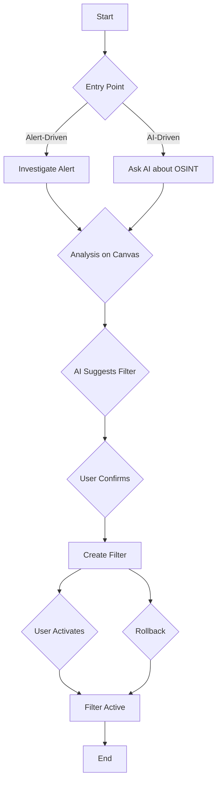
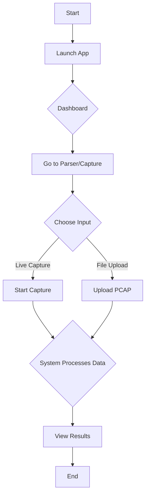
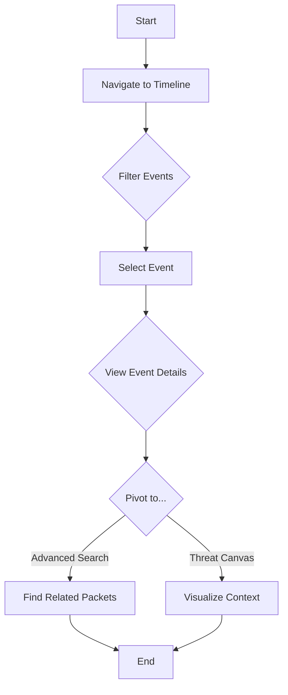

# {{project_name}} UX Design Specification

_Created on {{date}} by {{user_name}}_
_Generated using BMad Method - Create UX Design Workflow v1.0_

---

## Executive Summary

**Vision:** To create a lightweight, open-source forensics toolkit that empowers SMBs and hobbyists with easy-to-use, powerful security analytics.

**Users:** Security teams in small to medium businesses, as well as security-conscious home users.
**Core Experience:** The central workflow will be reviewing threat analytics and seamlessly applying them to automatically generate packet filters for alerts and threat detection.
**Desired Feeling:** The experience should feel **Calm and Focused**, enabling users to work efficiently without feeling overwhelmed.
**Platform:** A web-based dashboard, complemented by a command-line interface (CLI).
**Inspiration:** Our design will be guided by the information density of Wireshark, the prioritized guidance of Nessus, the seamless workflow of Snyk, and the powerful visualizations of MISP and Grafana.
**UX Complexity:** Medium.

---

## 1. Design System Foundation

### 1.1 Design System Choice

**Decision:** shadcn/ui (latest version as of project start)

**Rationale:**
The project is already built with React, TypeScript, and Tailwind CSS. `shadcn/ui` is a collection of re-usable components built on top of Radix UI (for accessibility and behavior) and styled with Tailwind CSS. This choice offers the following benefits:

*   **Seamless Integration:** It integrates perfectly with the existing technology stack, avoiding conflicts and leveraging the current styling approach.
*   **Flexibility and Control:** Components are copied directly into the project, allowing for full customization to match the desired "Calm and focused" aesthetic and specific brand needs.
*   **Accessibility and Performance:** Built on Radix UI, it ensures high accessibility standards and performance.
*   **Accelerated Development:** Provides a robust set of pre-built, well-designed components, speeding up UI development while maintaining consistency.
*   **Consistency with Existing UI:** The existing UI components already follow a dark-themed, minimalist aesthetic, which aligns well with the design philosophy of `shadcn/ui`.

---

## 2. Core User Experience

### 2.1 Defining Experience

The defining experience of net-pack-parser is a powerful combination of:

*   **Conversational AI:** Interacting with the system to understand and refine threat analytics, similar to having a dialogue with an intelligent assistant.
*   **Real-time Collaborative Canvas:** A dynamic and interactive workspace for analyzing threats, detecting patterns, and responding to incidents, akin to a shared digital whiteboard.

This dual approach aims to make the complex task of threat detection and response more intuitive, efficient, and engaging for users.

### 2.2 Desired Emotional Response

The desired emotional response for users of this application is to feel **Calm and focused**. This feeling should be a direct result of the application's design, which will prioritize clarity, predictability, and a sense of control. The user interface will be designed to minimize distractions and cognitive load, allowing users to concentrate on the task of analyzing threats and creating filters.

### 2.3 Inspiration Analysis

The following applications were analyzed to draw inspiration for the user experience of net-pack-parser:

*   **Wireshark:** A powerful network protocol analyzer.
*   **Nessus:** A vulnerability scanner.
*   **Loki Scanner (Grafana Loki):** A log aggregation system.
*   **Snyk:** A developer security platform.
*   **MISP:** A threat intelligence platform.

From this analysis, the following key principles have been synthesized for the design of net-pack-parser:

1.  **Information Density and Control (from Wireshark):** The UI will present dense information in a highly customizable format. Users will have control over the data presentation, with powerful filtering and visual highlighting capabilities.
2.  **Prioritization and Guidance (from Nessus):** The UI will guide users in prioritizing threats and analytics, using visual cues to draw attention to critical information.
3.  **Seamless Workflow Integration (from Snyk):** The core action of creating filters from analytics will be as automated and seamless as possible, with the UI acting as an assistant to the user.
4.  **Powerful Visualizations (from MISP and Grafana/Loki):** The web dashboard will feature powerful visualizations, including graph-based views, to illustrate relationships and correlations within threat analytics data.
5.  **Calm and Focused:** All UI elements will be presented in a clean, uncluttered interface that minimizes cognitive load, in line with the desired emotional response.

### 2.4 Novel UX Patterns

The core interaction of net-pack-parser is a novel UX pattern named **AI-driven Automated Packet Filter Creation**. This pattern combines conversational AI and a real-time collaborative canvas to make threat detection and response more intuitive and effective.

The mechanics of this interaction are as follows:

*   **User Goal:** To prevent threat actors from infiltrating their systems and networks by both responding to generated alerts and proactively processing Open Source Intelligence (OSINT) to create new detections.
*   **Trigger:** The user can initiate this action in multiple ways:
    *   **From an Alert:** Clicking a button (e.g., "Create Filter") on a generated alert.
    *   **From OSINT:** Pasting threat intelligence data into a conversational AI interface and asking it to create a filter.
    *   **From the Canvas:** Dragging and dropping a threat indicator (e.g., a malicious IP address) onto a designated "create filter" area on the collaborative canvas.
*   **Feedback:** The user will receive real-time feedback on the collaborative canvas. As the AI processes the request, it will visually construct the new filter, showing the logic it's applying. The conversational AI will provide textual confirmation of its actions.
*   **Success:** A clear notification will confirm that the new filter has been created and is now active. The UI will visually represent the new filter and its impact, for example, by showing it in a list of active filters and updating a dashboard to reflect the new detection capability.
*   **Error Recovery:** To ensure users feel confident and in control, the system will provide a "rollback" or "revert" feature. This will allow users to easily undo the creation of a filter or revert to a previous known-good set of filters if a mistake is made.

**Deep Dive: Exploring the Novel Pattern**

*   **Similar Patterns:** We can draw inspiration from conversational AI interfaces (ChatGPT, Google Gemini) for the AI interaction, and collaborative canvas tools (Figma, Miro) for the visual workspace. Automated actions from data are seen in Snyk's AI-powered remediation and SIEM/SOAR playbooks.
*   **Speed:** The filter creation and application should be near real-time to be effective in threat detection.
*   **Delight:** Delight will come from the seamlessness of the process, the clear visual confirmation on the canvas, the intelligent and helpful responses from the AI, and subtle animations that guide the user's attention.
*   **Platform Considerations:** The primary platform for full filter creation and management will be the web dashboard, given the complexity of the task. Mobile might be used for alert notifications and quick approvals, but not for deep analysis or filter construction.
*   **Shareability:** Users will be eager to share the ease and power of automatically generating complex filters, the visual clarity of the collaborative canvas, and the intelligent conversation with the AI.

---

## 3. Visual Foundation

### 3.1 Color System

The visual foundation is built on the "Deep Dive" theme, which is professional, focused, and designed to evoke a sense of trust and security.

*   **Color System:**
    *   **Theme:** "Deep Dive" (Professional & Focused)
    *   **Primary:** Deep Blue (`#2563EB`) for interactive elements and calls to action.
    *   **Accent:** Teal (`#14B8A6`) for secondary actions and highlights.
    *   **Neutral:** A scale of grays from `#111827` (darkest background) to `#F9FAFB` (lightest text).
    *   **Semantic Colors:**
        *   **Error:** Red (`#DC2626`)
        *   **Warning:** Amber (`#F59E0B`)
        *   **Success:** Green (`#10B981`)
        *   **Info:** Blue (`#3B82F6`)
*   **Typography System:**
    *   **Font Family:** A sans-serif system font stack for clarity and performance (`-apple-system, BlinkMacSystemFont, 'Segoe UI', Roboto, ...`).
    *   **Type Scale:** A modular scale for headings (h1-h6) and body text, ensuring clear hierarchy.
    *   **Font Weights:** A limited set of weights (e.g., `normal`, `medium`, `semibold`) to maintain a clean look.
*   **Spacing and Layout Foundation:**
    *   **Base Unit:** An 8px grid system for consistent spacing.
    *   **Spacing Scale:** A token-based scale (e.g., `space-1`, `space-2`) for predictable margins and padding.
    *   **Layout Grid:** A standard 12-column grid for responsive layouts.

**Interactive Visualizations:**

- Color Theme Explorer: [ux-color-themes.html](./ux-color-themes.html)

---

## 4. Design Direction

### 4.1 Chosen Design Approach

**Decision:** A hybrid approach combining elements of "Focused Threat Dashboard" and "Collaborative Threat Canvas."

**Rationale:** This hybrid approach best supports the core experience of "AI-driven Automated Packet Filter Creation" by providing both a clear overview of critical threats and an interactive space for analysis and filter building. It balances the need for immediate actionable insights with the flexibility for deep-dive investigation and collaborative work.

**Layout Decisions:**
*   **Navigation pattern:** Standard sidebar navigation (as per existing UI).
*   **Content structure:** A flexible main content area that can switch between a dashboard-like view (for overview and alerts) and a canvas-like view (for interactive analysis).
*   **Content organization:** Card-based for summaries and alerts, list/table-based for detailed data, and a dynamic canvas for visual correlation.

**Hierarchy Decisions:**
*   **Visual density:** Balanced. Information-rich but with clear visual hierarchy to avoid overwhelming the user.
*   **Header emphasis:** Clear, concise headers for sections and panels.
*   **Content focus:** Dynamic, shifting between critical alerts on the dashboard and interactive elements on the canvas.

**Interaction Decisions:**
*   **Primary action pattern:** Prominent buttons for "Create Filter" (from alerts or AI suggestions), drag-and-drop for canvas interactions, and conversational AI input.
*   **Information disclosure:** Progressive disclosure for complex details, with drill-down capabilities.
*   **User control:** Guided by AI suggestions but with full user override and manual control.

**Visual Style Decisions:**
*   **Weight:** Balanced, leveraging the "Deep Dive" color theme.
*   **Depth cues:** Subtle shadows and borders to define interactive elements and content blocks.
*   **Border style:** Subtle, to maintain a clean and modern look.

**Interactive Mockups:**

- Design Direction Showcase: [ux-design-directions.html](./ux-design-directions.html)

---

## 5. User Journey Flows

### 5.1 Critical User Paths

The following user journeys are critical to the success of net-pack-parser.

**1. Threat Detection and Filter Creation (Core Journey)**

This journey represents the primary workflow for identifying and responding to threats. It allows for a flexible, multi-modal interaction that combines a dashboard, a collaborative canvas, and a conversational AI.

*   **User Goal:** To identify a threat and create a filter to block it in the future.
*   **Entry Point:** A critical alert on the dashboard, or a piece of OSINT pasted into the AI chat.
*   **Flow:**
    1.  **Entry:**
        *   **(Alert-Driven):** User sees a "Critical Alert" card on the dashboard and clicks "Investigate".
        *   **(AI-Driven):** User pastes a suspicious IP address into the AI chat and asks, "What is this? Can we block it?"
    2.  **Analysis:**
        *   The user is taken to the "Collaborative Threat Canvas".
        *   The alert/IP address is displayed as a central node on the canvas.
        *   The AI populates the canvas with related information (e.g., other affected systems, related domains, MITRE ATT&CK mapping).
        *   The AI chat provides a summary of the threat and suggests a course of action: "This IP is associated with known malware. I recommend creating a filter to block all traffic from this source. Would you like to proceed?"
    3.  **Filter Creation:**
        *   User clicks "Create Filter" in the AI chat or on the canvas.
        *   A visual representation of the new filter appears on the canvas, connected to the threat it's designed to block.
        *   The user can inspect the filter's logic (e.g., `block ip 192.168.1.100`) and, if desired, enter an "advanced mode" to edit it directly.
    4.  **Activation:**
        *   User clicks "Activate Filter".
        *   The system provides immediate feedback: the filter on the canvas turns "active" (e.g., changes color), and a success notification appears.
        *   The AI confirms: "The filter is now active. I will monitor for any further activity from this source."
    5.  **Error Recovery:**
        *   A "History" panel shows a log of all created filters.
        *   Each entry has a "Rollback" button, allowing the user to deactivate the filter and revert to the previous state.

**2. Initial Setup and Data Ingestion**

This journey describes how a new user gets started with the application.

*   **User Goal:** To begin analyzing network traffic.
*   **Flow:**
    1.  User launches the application and is greeted by the dashboard.
    2.  A "Get Started" call to action directs the user to the "Parser" or "Capture" page.
    3.  The user chooses between:
        *   **Live Capture:** Clicks "Start Capture" to begin monitoring their browser's network activity in real-time.
        *   **File Upload:** Clicks "Upload PCAP" to upload an existing network capture file.
    4.  The system processes the data and provides immediate feedback, populating the "Packets" and "Dashboard" views.

**3. Forensic Investigation and Timeline Analysis**

This journey outlines how a user can perform a deep-dive investigation into a past incident.

*   **User Goal:** To understand the sequence of events during a security incident.
*   **Flow:**
    1.  User navigates to the "Timeline" view.
    2.  The user can filter events by date range, severity, or type.
    3.  The user clicks on a specific event to see detailed information and related evidence.
    4.  From the event details, the user can pivot to the "Advanced Search" to find related packets or to the "Threat Canvas" to visualize the event's context.

---

## 6. Component Library

### 6.1 Component Strategy

Our component library strategy is to leverage the `shadcn/ui` design system as a foundation, and build custom components for specialized functionality.

**From Design System (`shadcn/ui`):**
We will use the following components from `shadcn/ui` to ensure consistency and accessibility:
*   `Button`: For all actions.
*   `Card`: For dashboard widgets and alerts.
*   `Table`: For displaying packets, files, etc.
*   `Input`: For search and forms.
*   `Select`: For filtering.
*   `Dialog` / `Modal`: For confirmations and detailed views.
*   `Tabs`: To switch between views within a component.
*   `Tooltip`: For providing extra information.
*   `Avatar`: For user profiles (future).
*   `Dropdown Menu`: For action menus.
*   `Sheet`: For side panels (e.g., AI chat).

**Custom Components:**
The following custom components will be built to support the unique features of net-pack-parser:
*   **`CollaborativeThreatCanvas`:** This is the core novel component. It will provide a visual, interactive workspace for analyzing threat relationships and building filters.
    *   **Anatomy:** Nodes (entities), Edges (relationships), Toolbar (zoom, pan), Context Menu (actions).
    *   **States:** Default, Hover, Selected, Loading.
    *   **Behavior:** Drag and Drop, Pan and Zoom.
    *   **Accessibility:** Keyboard navigation, ARIA roles, screen reader announcements.
*   **`ConversationalAI`:** A chat interface for interacting with the AI, including a message list, input area, and suggested actions.
*   **`TimelineView`:** A component for visualizing events chronologically.
*   **`FilterBuilder`:** A UI for constructing and editing filters, both visually on the canvas and through a form-based interface for advanced users.

**Components Requiring Heavy Customization:**
*   **`DashboardCard`:** Based on the `Card` component, but with specific layouts and data visualizations for different metrics.
*   **`DataTable`:** The base `Table` component will be extended with features like sorting, filtering, and expandable rows for detailed views.

---

## 7. UX Pattern Decisions

### 7.1 Consistency Rules

To ensure a consistent and predictable user experience, the following UX patterns will be applied across the application.

*   **Button Hierarchy:**
    *   **Primary action:** Solid blue (`bg-blue-600`). Example: "Activate Filter".
    *   **Secondary action:** Ghost/outline style (`border-blue-600`). Example: "Export Results".
    *   **Tertiary action:** Subtle link style (`text-blue-400`). Example: "View Details".
    *   **Destructive action:** Solid red (`bg-red-600`). Example: "Delete Packet".
*   **Feedback Patterns:**
    *   **Success:** Toast notification (top-right), green. Example: "Filter activated successfully."
    *   **Error:** Toast notification, red. Example: "Failed to upload PCAP file."
    *   **Warning:** Inline message, amber. Example: "This filter may impact performance."
    *   **Info:** Subtle inline message, blue. Example: "Live capture started."
    *   **Loading:** Spinners for buttons, skeleton loaders for content blocks.
*   **Form Patterns:**
    *   **Label position:** Above the input field.
    *   **Required field indicator:** Asterisk.
    *   **Validation timing:** On blur for individual fields, on submit for the form.
    *   **Error display:** Inline message below the field. Example: "This field is required."
*   **Modal Patterns:**
    *   **Size variants:** Small (confirmations), Medium (forms), Large (detailed views).
    *   **Dismiss behavior:** Click outside, Escape key, explicit close button.
    *   **Focus management:** Auto-focus on the first input or primary action.
*   **Navigation Patterns:**
    *   **Active state indication:** Solid blue background on the active sidebar item.
    *   **Breadcrumb usage:** For nested views within a main section. Example: `Dashboard > Packets > Packet Details`.
*   **Empty State Patterns:**
    *   **First use:** Guidance text and a primary call to action. Example: "No packets found. Start a capture to begin."
    *   **No results:** Helpful message and a "Clear filters" button. Example: "No packets match your search. Clear filters to see all packets."
*   **Confirmation Patterns:**
    *   **Delete:** Modal confirmation for irreversible deletions. Example: "Are you sure you want to delete this packet? This action cannot be undone."
    *   **Leave unsaved:** Browser's `beforeunload` prompt.
*   **Notification Patterns:**
    *   **Placement:** Top-right corner of the screen.
    *   **Duration:** Auto-dismiss after 5 seconds, with a close button.
*   **Search Patterns:**
    *   **Trigger:** On-demand (click "Search" button).
    *   **Results display:** In a table or list below the search form.
*   **Date/Time Patterns:**
    *   **Format:** Relative for recent events ("2 minutes ago"), absolute for older events ("Nov 17, 2025, 10:30 AM").

---

## 8. Responsive Design & Accessibility

### 8.1 Responsive Strategy

The application will be fully responsive, adapting the experience to different screen sizes while maintaining functionality and clarity.

*   **Breakpoint Strategy:**
    *   **Mobile (`< 768px`):** Single-column layout. The sidebar will be hidden by default and slide in as an overlay. Data-dense components like tables will collapse into a card-based list view.
    *   **Tablet (`768px - 1024px`):** Two-column layouts where appropriate. The sidebar may be collapsed to an icon-only view to maximize content space.
    *   **Desktop (`> 1024px`):** Full multi-column layouts. The sidebar will be visible by default.
*   **Adaptation Patterns:**
    *   **Navigation:** The sidebar will collapse to a hamburger menu on mobile.
    *   **Canvas:** On smaller screens, the collaborative canvas will be pannable and zoomable, with less information visible at once to maintain clarity.
    *   **Tables:** On mobile, tables will either become horizontally scrollable or transform into a more readable card-based list view.
    *   **Touch Targets:** All interactive elements will have a minimum touch target size of 44x44 pixels to ensure usability on mobile devices.

### 8.2 Accessibility Strategy

Accessibility is a core requirement to ensure the application is usable by everyone.

*   **Compliance Target:** WCAG 2.1 Level AA.
*   **Key Requirements:**
    *   **Color Contrast:** All text and UI elements will meet AA contrast ratio standards.
    *   **Keyboard Navigation:** All interactive elements will be focusable and operable with a keyboard.
    *   **Focus Indicators:** Clear and visible focus states will be present on all interactive elements.
    *   **ARIA Labels:** Meaningful ARIA labels will be used for all controls, especially on the interactive canvas, to provide context to screen readers.
    *   **Alt Text:** All meaningful images and icons will have descriptive alt text.
    *   **Form Labels:** All form inputs will have properly associated labels.
*   **Testing Strategy:**
    *   **Automated:** Use `axe-core` (e.g., via `vite-plugin-checker`) to catch common accessibility issues during development.
    *   **Manual:** Regularly perform keyboard-only navigation testing and screen reader testing (e.g., with VoiceOver on macOS and NVDA on Windows).

---

## 9. Implementation Guidance

### 9.1 Completion Summary

Excellent work! Your UX Design Specification is complete.

**What we created together:**

*   **Design System:** shadcn/ui with custom components for specialized functionality.
*   **Visual Foundation:** "Deep Dive" color theme with a sans-serif typography system and an 8px grid spacing system.
*   **Design Direction:** A hybrid approach combining elements of "Focused Threat Dashboard" and "Collaborative Threat Canvas," balancing immediate insights with interactive analysis.
*   **User Journeys:** Three critical user journeys designed, including the core "Threat Detection and Filter Creation" journey, "Initial Setup and Data Ingestion," and "Forensic Investigation and Timeline Analysis."
*   **UX Patterns:** A comprehensive set of consistency rules established for button hierarchy, feedback, forms, modals, navigation, empty states, confirmations, notifications, search, and date/time patterns.
*   **Responsive Strategy:** A full responsive strategy defined with breakpoints for mobile, tablet, and desktop, and adaptation patterns for key components.
*   **Accessibility:** WCAG 2.1 Level AA compliance requirements defined, with automated and manual testing strategies.

**Your Deliverables:**
*   UX Design Document: `docs/ux-design-specification.md`
*   Interactive Color Themes: `docs/ux-color-themes.html`
*   Design Direction Mockups: `docs/ux-design-directions.html`

**What happens next:**
*   Designers can create high-fidelity mockups from this foundation.
*   Developers can implement with clear UX guidance and rationale.
*   All your design decisions are documented with reasoning for future reference.

You've made thoughtful choices through visual collaboration that will create a great user experience. Ready for design refinement and implementation!

---

## Appendix

### Related Documents

- Product Requirements: `{{prd_file}}`
- Product Brief: `{{brief_file}}`
- Brainstorming: `{{brainstorm_file}}`

### Core Interactive Deliverables

This UX Design Specification was created through visual collaboration:

- **Color Theme Visualizer**: {{color_themes_html}}
  - Interactive HTML showing all color theme options explored
  - Live UI component examples in each theme
  - Side-by-side comparison and semantic color usage

- **Design Direction Mockups**: {{design_directions_html}}
  - Interactive HTML with 6-8 complete design approaches
  - Full-screen mockups of key screens
  - Design philosophy and rationale for each direction

### Optional Enhancement Deliverables

_This section will be populated if additional UX artifacts are generated through follow-up workflows._

<!-- Additional deliverables added here by other workflows -->

### Next Steps & Follow-Up Workflows

This UX Design Specification can serve as input to:

- **Wireframe Generation Workflow** - Create detailed wireframes from user flows
- **Figma Design Workflow** - Generate Figma files via MCP integration
- **Interactive Prototype Workflow** - Build clickable HTML prototypes
- **Component Showcase Workflow** - Create interactive component library
- **AI Frontend Prompt Workflow** - Generate prompts for v0, Lovable, Bolt, etc.
- **Solution Architecture Workflow** - Define technical architecture with UX context

### Version History

| Date     | Version | Changes                         | Author        |
| -------- | ------- | ------------------------------- | ------------- |
| {{date}} | 1.0     | Initial UX Design Specification | {{user_name}} |

---

_This UX Design Specification was created through collaborative design facilitation, not template generation. All decisions were made with user input and are documented with rationale._
